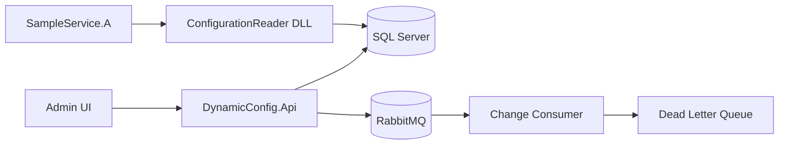

# Mimari

## Genel Bakış

## Katmanlar

### DynamicConfig.Library

Case'in ana çıktısı. Herhangi bir .NET 8 uygulamasına referans verilerek kullanılır.

- `ConfigurationReader`: Public API
- `InMemoryConfigurationCache`: ReaderWriterLockSlim ile thread-safe cache
- `SqlServerConfigurationStorage`: EF Core ile storage erişimi
- `ConfigurationTypeConverter`: Tip dönüşümleri
- Timer tabanlı refresh (version alanı kullanılmaz)

Refresh akışı:

1. Timer tetiklenir
2. `SemaphoreSlim` ile eşzamanlı refresh engellenir
3. Storage'dan aktif kayıtlar çekilir
4. Değişiklik varsa cache güncellenir
5. Storage hatasında mevcut cache korunur

### DynamicConfig.Infrastructure

- EF Core `ConfigurationDbContext`
- Repository pattern
- Polly retry (3 deneme, exponential backoff)
- RabbitMQ publisher/consumer
- Dead Letter Exchange + Queue

### DynamicConfig.Api

- REST CRUD endpointleri
- Static admin UI (`wwwroot`)
- Migration ve seed

## Tasarım Desenleri

| Desen | Kullanım |
|-------|----------|
| Repository | Data access soyutlama |
| Singleton | ConfigurationReader servis örneği |
| Background Service | RabbitMQ consumer |
| Retry (Polly) | Storage ve broker dayanıklılığı |
| Cache-Aside | In-memory configuration cache |

## Concurrency

- Cache okuma/yazma: `ReaderWriterLockSlim`
- Refresh işlemi: `SemaphoreSlim` (aynı anda tek refresh)
- RabbitMQ consumer: `BasicQos(1)` ile tek mesaj işleme

## Mesajlaşma

Exchange: `dynamic-config.exchange` (topic)

Queue: `dynamic-config.queue`

DLX: `dynamic-config.dlx`

DLQ: `dynamic-config.dlq`

Başarısız mesajlar `basic.nack(requeue=false)` ile DLQ'ya düşer.
